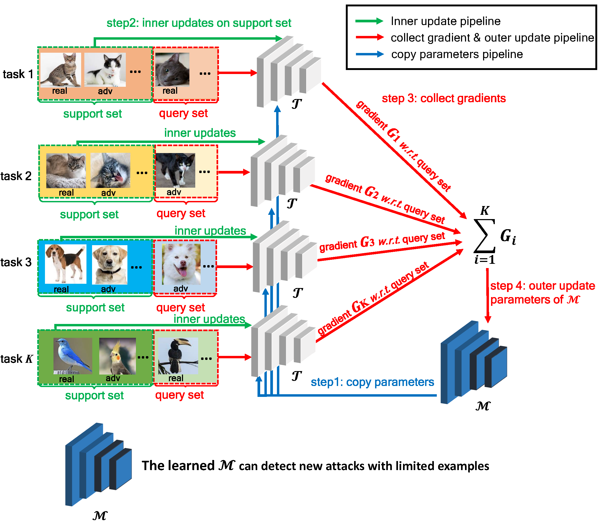
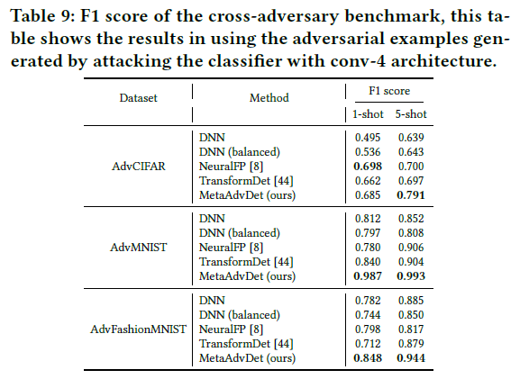
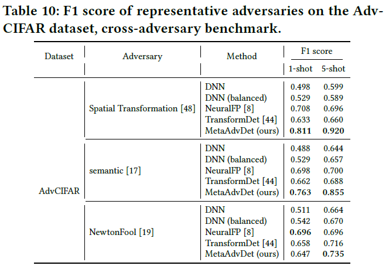
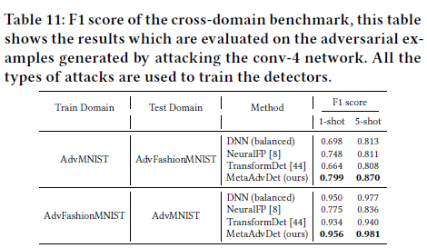
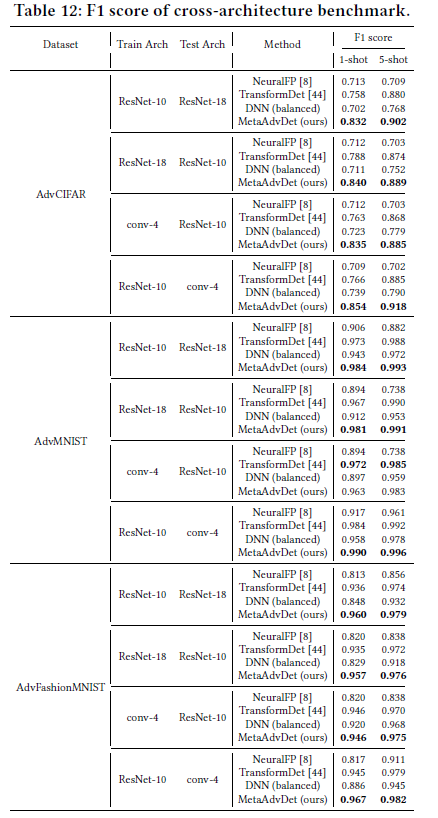
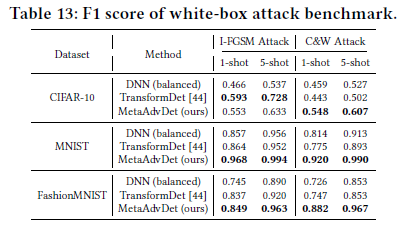
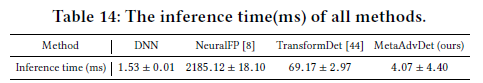

# MetaAdvDet
The official implementation of paper "MetaAdvDet: Towards Robust Detection of Evolving Adversarial Attacks", which is published on Proceedings of the 27th ACM International Conference on Multimedia (ACM MM 19).

By Chen Ma, Chenxu Zhao, Hailin Shi, Li Chen, Junhai Yong and Dan Zeng.

[[arXiv Paper]](https://arxiv.org/abs/1908.02199) [[ACM MM published version]](https://dl.acm.org/doi/10.1145/3343031.3350887) [[Slides]](https://raw.githubusercontent.com/machanic/MetaAdvDet/master/paper_figures/MetaAdvDet_Slides.pdf) [[Poster]](https://raw.githubusercontent.com/machanic/MetaAdvDet/master/paper_figures/MetaAdvDet_poster.pdf)

<p align="center"></p>

The procedure of MetaAdvDet training in one mini-batch. The approach consists of a double-network framework: M and T. M is the task-dedicated network which focuses on learning each task. It copies parameters from master network M at the beginning, and then trains on the support set. After a couple of iterations (inner update step), T converges and computes the gradient $G_i$ on the query set of task i. M accumulates the gradients to update its parameters which are prepared for the next mini-batch learning. The learned
M can be used to detect new attacks with limited new samples. More details can be found in Sec. 3.2 of the paper.
# Citation
We kindly ask anybody who uses this code cite the following bibtex：
```
@inproceedings{10.1145/3343031.3350887,
author = {Ma, Chen and Zhao, Chenxu and Shi, Hailin and Chen, Li and Yong, Junhai and Zeng, Dan},
title = {MetaAdvDet: Towards Robust Detection of Evolving Adversarial Attacks},
year = {2019},
isbn = {9781450368896},
publisher = {Association for Computing Machinery},
address = {New York, NY, USA},
url = {https://doi.org/10.1145/3343031.3350887},
doi = {10.1145/3343031.3350887},
booktitle = {Proceedings of the 27th ACM International Conference on Multimedia},
pages = {692–701},
numpages = {10},
keywords = {meta-learning, few-shot learning, evolving adversarial attacks, adversarial example detection},
location = {Nice, France},
series = {MM ’19}
}
```
# Abstract
Deep neural networks (DNNs) are vulnerable to the adversarial attack which is maliciously implemented by adding human-imperceptible perturbation to images and thus leads to incorrect prediction. 
Existing studies have proposed various methods to detect the new adversarial attacks.
However, new attack methods keep evolving constantly and yield new adversarial examples to bypass the existing detectors. It needs to collect tens of thousands samples to train detectors, while the new attacks evolve much more frequently than the high-cost data collection. Thus, this situation leads the newly evolved attack samples to remain in small scales.
To solve such few-shot problem with the evolving attacks, we propose a meta-learning based robust detection method to detect new adversarial attacks with limited examples. 
Specifically, the learning consists of a double-network framework: a task-dedicated network and a master network which alternatively learn the detection capability for either seen attack or a new attack.
To validate the effectiveness of our approach, we construct the benchmarks with few-shot-fashion protocols based on three conventional datasets, i.e. CIFAR-10, MNIST and Fashion-MNIST. Comprehensive experiments are conducted on them to verify the superiority of our approach with respect to the traditional adversarial attack detection methods.

# Installation
Requirement: Pytorch 0.4.0 or above, torchvision 1.3.0 or above

# How to train and test
## step 1. Generate the training data and organize them to the format of multi-tasks.
 (1) `git clone https://github.com/machanic/cleverhans_adversarial_example_gen`
 
 Then, `python cleverhans/generate_adv_script/generate_adversarial_images_script.py --attack FGSM --dataset CIFAR-10 --arch conv4` to generate the FGSM adversarial examples.
 
 To generate different types of adversarial examples, you can pass different `--attack`, and the available adversaries are listed in `META_ATTACKER_INDEX` list of `cleverhans/generate_adv_script/config.py`, which are `["clean", "FGSM", "MI_FGSM_L_infinity", "BIM_L_infinity", "PGD_L_infinity", "SPSA", "CW_L2", "deep_fool_L2", "newton_fool", "jsma","EAD","spatial_transform","VAT","max_confidence", "semantic", "LBFGS"]`.
 
 (2) Organize all adversarial examples of different attacks into the format of multi-tasks.
 
 Type `python cleverhans/generate_adv_script/split_data_script.py --dataset CIFAR-10` to convert the data and store the multi-task format data to the hard disk.

## step 2.Train the MetaAdvDet.

### Cross-Adversary benchmark
1-shot in CIFAR-10 dataset

`python meta_adv_detector/train.py --num_support 1 --epoch 3 --arch conv3 --dataset CIFAR-10 --split_protocol TRAIN_I_TEST_II --load_task_mode LOAD --no_random_way --study_subject cross_adv_group`

5-shot in CIFAR-10 dataset

`python meta_adv_detector/train.py --num_support 5 --epoch 3 --arch conv3 --dataset CIFAR-10 --split_protocol TRAIN_I_TEST_II --load_task_mode LOAD --no_random_way --study_subject cross_adv_group`

### Cross-Domain benchmark

1-shot MNIST --> FashionMNIST

`python meta_adv_detector/train.py --num_support 1 --epoch 3 --arch conv3 --dataset MNIST --split_protocol TRAIN_ALL_TEST_ALL --load_task_mode LOAD --no_random_way --study_subject cross_domain`

5-shot FashionMNIST --> MNIST

`python meta_adv_detector/train.py --num_support 5 --epoch 3 --arch conv3 --dataset FashionMNIST --split_protocol TRAIN_ALL_TEST_ALL --load_task_mode LOAD --no_random_way --study_subject cross_domain`

### Cross-Arch benchmark
conv4 --> (resnet10/resnet18) in CIFAR-10 dataset

`python meta_adv_detector/train.py --num_support 1 --epoch 3 --arch conv3 --adv_arch conv4 --dataset CIFAR-10 --split_protocol TRAIN_ALL_TEST_ALL --load_task_mode LOAD --no_random_way --study_subject cross_arch`

resnet10 --> (conv4/resnet18) in CIFAR-10 dataset

`python meta_adv_detector/train.py --num_support 1 --epoch 3 --arch conv3 --adv_arch resnet10 --dataset CIFAR-10 --split_protocol TRAIN_ALL_TEST_ALL --load_task_mode LOAD --no_random_way --study_subject cross_arch`

resnet18 --> (conv4/resnet18) in CIFAR-10 dataset

`python meta_adv_detector/train.py --num_support 1 --epoch 3 --arch conv3 --adv_arch resnet18 --dataset CIFAR-10 --split_protocol TRAIN_ALL_TEST_ALL --load_task_mode LOAD --no_random_way --study_subject cross_arch`


## step 3 Evaluate MetaAdvDet.

### Cross-Adversary benchmark
`python meta_adv_detector/train.py --arch conv3 --dataset CIFAR-10 --split_protocol TRAIN_I_TEST_II --load_task_mode LOAD --no_random_way --evaluate --study_subject cross_adv_group`


### Cross-Domain benchmark
`python meta_adv_detector/train.py --arch conv3 --dataset CIFAR-10 --split_protocol TRAIN_ALL_TEST_ALL --load_task_mode LOAD --no_random_way --evaluate --study_subject cross_domain --cross_domain_source MNIST --cross_domain_target FashionMNIST`

or

`python meta_adv_detector/train.py --arch conv3 --dataset CIFAR-10 --split_protocol TRAIN_ALL_TEST_ALL --load_task_mode LOAD --no_random_way --evaluate --study_subject cross_domain --cross_domain_source FashionMNIST --cross_domain_target MNIST`

### Cross-Arch benchmark
`python meta_adv_detector/train.py --arch conv3 --dataset CIFAR-10 --split_protocol TRAIN_ALL_TEST_ALL --load_task_mode LOAD --no_random_way --evaluate --study_subject cross_arch --cross_arch_source conv4 --cross_arch_target resnet10`

`python meta_adv_detector/train.py --arch conv3 --dataset CIFAR-10 --split_protocol TRAIN_ALL_TEST_ALL --load_task_mode LOAD --no_random_way --evaluate --study_subject cross_arch --cross_arch_source resnet10 --cross_arch_target conv4`

`python meta_adv_detector/train.py --arch conv3 --dataset CIFAR-10 --split_protocol TRAIN_ALL_TEST_ALL --load_task_mode LOAD --no_random_way --evaluate --study_subject cross_arch --cross_arch_source resnet10 --cross_arch_target resnet18`

# Experiment Results
<p align="center"></p>

<center>The experiment results of cross-adversary benchmark.</center>

<p align="center"></p>

<center>The results of typical adversaries in cross-adversary benchmark.</center>

<p align="center"></p>

<center>The results of typical adversaries in cross-domain benchmark.</center>

<p align="center"></p>

<center>The results of typical adversaries in cross-arch benchmark.</center>

<p align="center"></p>

<center>The experiment results of white-box attack benchmark.</center>

<p align="center"></p>

<center>The inference speed test results.</center>

Additional experiment results are listed in Sec. 5 of the paper.

# Download Trained Model Files
I have uploaded all the trained model files and experimental results data files into the cloud disk drive, which is located at [Tsinghua Cloud Disk](https://cloud.tsinghua.edu.cn/d/d98471b4d050407c9a7d/).
